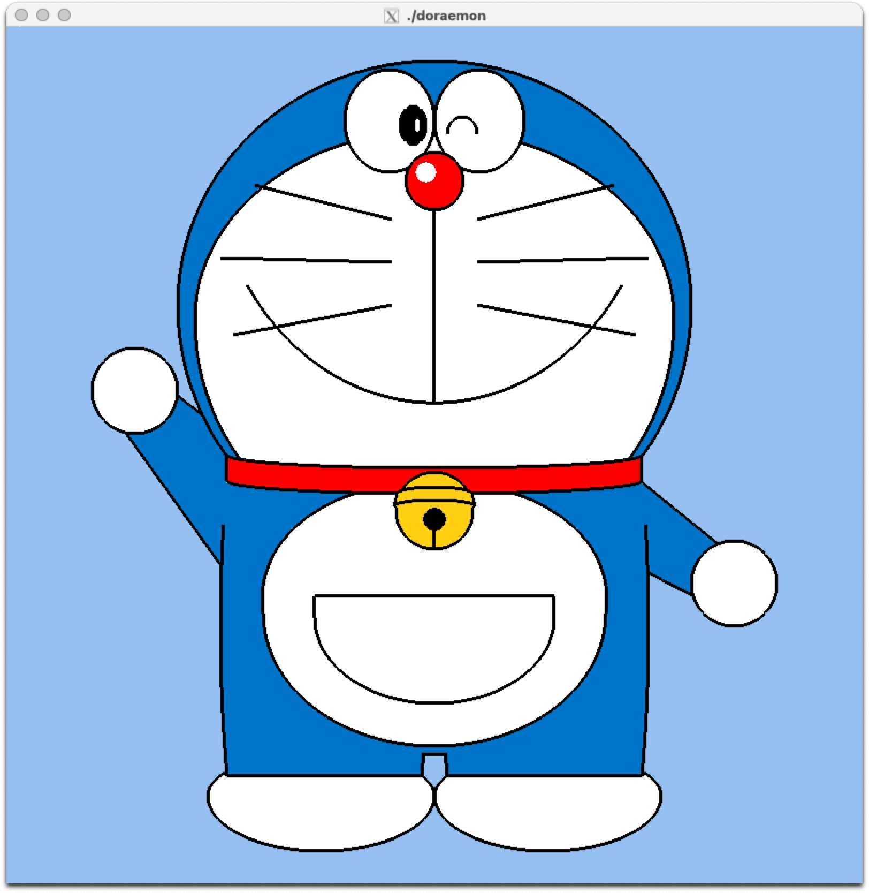

# OpenGL 実験

このリポジトリは、3 週間の OpenGL 実験のコードとメモを含んでいます。

---

## 進捗状況

### Week 1

-   ドラえもんの頭、目、鼻、襟（Collar）を実装。
-   不要な円の下部を背景色で隠す処理を追加。
-   口（縦線とスマイルライン）を追加。
-   左右それぞれ 3 本のひげ（Whiskers）を追加。
-   ベルのデザインを実装。

#### ドラえもんの進捗画像

### Week 2

-   [ === WORK IN PROGRESS === ]

### Week 3

-   [ === WORK IN PROGRESS === ]

---

## ファイル構造
