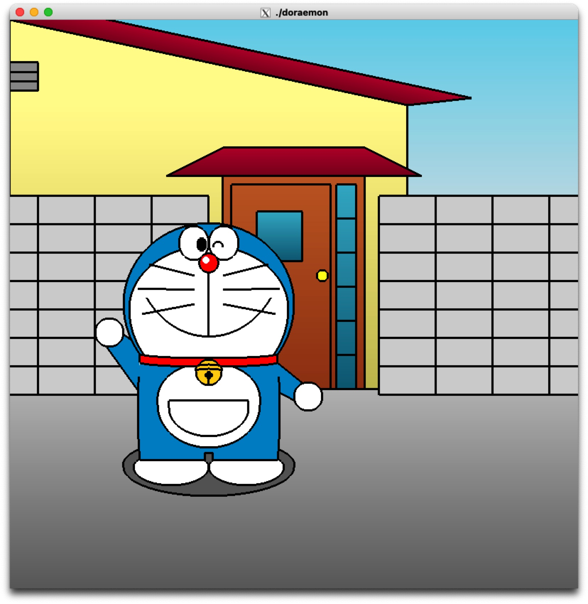

# OpenGL 実験

このリポジトリは、3 週間の OpenGL 実験のコードとメモを含んでいます。

---

## 進捗状況

【リファクタリング予定あり】

### Week 1

-   頭部（青い外側の円と白い内側の円）
-   目（左右の楕円、黒目、ウィンク）
-   鼻（赤い円と白い光沢部分）
-   口（縦線とスマイルライン）
-   ひげ（左右に各 3 本）
-   襟（赤い部分と黒い輪郭線）
-   ベル（黄色の円、黒い中心円、デザインライン）
-   体（青い体部分と白い内側の楕円形）
-   4 次元ポケット（体の中央に配置）
-   足（白い楕円形で表現）

#### ドラえもんの進捗画像

### Week 2

-   [ === WORK IN PROGRESS === ]

### Week 3

-   [ === WORK IN PROGRESS === ]

---

## ファイル構造
